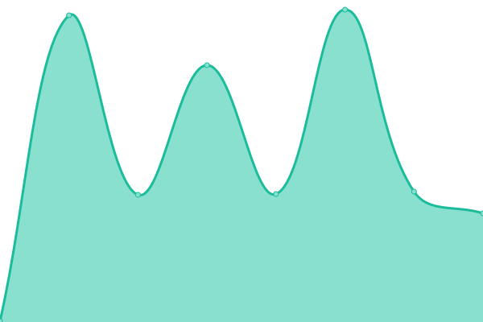
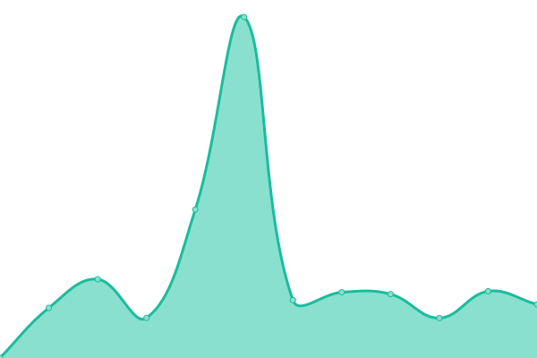
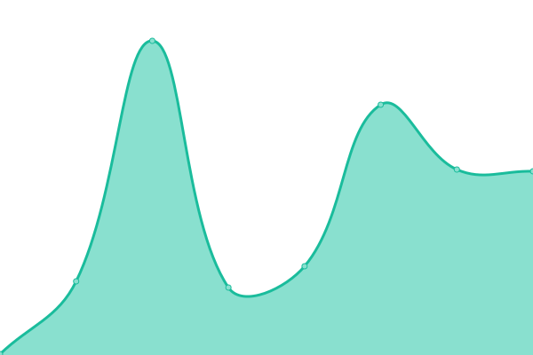
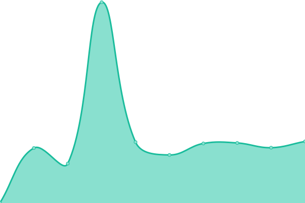
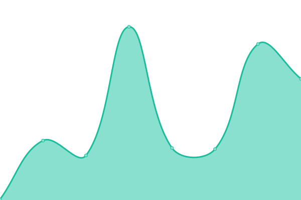

# [📈 Live Status](https://statussi.millers.cloud): <!--live status--> **🟩 All systems operational**

This repository contains the open-source uptime monitor and status page for [Blaine Miller](blaineam.com), powered by [Upptime](https://github.com/upptime/upptime).

With [Upptime](https://upptime.js.org), you can get your own unlimited and free uptime monitor and status page, powered entirely by a GitHub repository. We use [Issues](https://github.com/blaineam/statussi/issues) as incident reports, [Actions](https://github.com/blaineam/statussi/actions) as uptime monitors, and [Pages](https://statussi.millers.cloud) for the status page.

<!--start: status pages-->
<!-- This summary is generated by Upptime (https://github.com/upptime/upptime) -->
<!-- Do not edit this manually, your changes will be overwritten -->
<!-- prettier-ignore -->
| URL | Status | History | Response Time | Uptime |
| --- | ------ | ------- | ------------- | ------ |
|  [Blaine's Portfolio](https://wemiller.com) | 🟩 Up | [blaine-s-portfolio.yml](https://github.com/blaineam/statussi/commits/HEAD/history/blaine-s-portfolio.yml) | 

 2100ms
     
 | 

<a href="https://status.wemiller.com/history/blaine-s-portfolio">100.00%</a>
    

|  [We Miller Apps](https://apps.wemiller.com) | 🟩 Up | [we-miller-apps.yml](https://github.com/blaineam/statussi/commits/HEAD/history/we-miller-apps.yml) | 

 340ms
     
 | 

<a href="https://status.wemiller.com/history/we-miller-apps">100.00%</a>
    

|  [We Miller Sites](https://sites.wemiller.com) | 🟩 Up | [we-miller-sites.yml](https://github.com/blaineam/statussi/commits/HEAD/history/we-miller-sites.yml) | 

 384ms
     
 | 

<a href="https://status.wemiller.com/history/we-miller-sites">100.00%</a>
    

|  [120 Media](https://120.media) | 🟩 Up | [120-media.yml](https://github.com/blaineam/statussi/commits/HEAD/history/120-media.yml) | 

 578ms
     
 | 

<a href="https://status.wemiller.com/history/120-media">99.83%</a>
    

|  [Luma Friend](https://luma.dog) | 🟩 Up | [luma-friend.yml](https://github.com/blaineam/statussi/commits/HEAD/history/luma-friend.yml) | 

 722ms
     
 | 

<a href="https://status.wemiller.com/history/luma-friend">100.00%</a>
    

|  [Cenode Portfolio](https://cenode.wemiller.com) | 🟩 Up | [cenode-portfolio.yml](https://github.com/blaineam/statussi/commits/HEAD/history/cenode-portfolio.yml) | 

 293ms
     
 | 

<a href="https://status.wemiller.com/history/cenode-portfolio">100.00%</a>
    

|  [Featheread](https://featheread.wemiller.com) | 🟩 Up | [featheread.yml](https://github.com/blaineam/statussi/commits/HEAD/history/featheread.yml) | 

 247ms
     
 | 

<a href="https://status.wemiller.com/history/featheread">100.00%</a>
    

|  [Cache API](https://cacheapi.wemiller.com) | 🟩 Up | [cache-api.yml](https://github.com/blaineam/statussi/commits/HEAD/history/cache-api.yml) | 

 229ms
     
 | 

<a href="https://status.wemiller.com/history/cache-api">100.00%</a>
    

|  [Cache Website](https://cache.wemiller.com) | 🟩 Up | [cache-website.yml](https://github.com/blaineam/statussi/commits/HEAD/history/cache-website.yml) | 

 878ms
     
 | 

<a href="https://status.wemiller.com/history/cache-website">100.00%</a>
    

|  [Blaine's CDN](https://q6g1.c10.e2-1.dev/blaineam/data/static/media/images/theme/favicon.png) | 🟩 Up | [blaine-s-cdn.yml](https://github.com/blaineam/statussi/commits/HEAD/history/blaine-s-cdn.yml) | 

 550ms
     
 | 

<a href="https://status.wemiller.com/history/blaine-s-cdn">100.00%</a>
    

|  [We Miller Go - Link Sharing](https://go.wemiller.com/) | 🟩 Up | [we-miller-go-link-sharing.yml](https://github.com/blaineam/statussi/commits/HEAD/history/we-miller-go-link-sharing.yml) | 

 269ms
     
 | 

<a href="https://status.wemiller.com/history/we-miller-go-link-sharing">100.00%</a>
    

|  [We Miller Download - Media Downloader](https://download.wemiller.com/) | 🟩 Up | [we-miller-download-media-downloader.yml](https://github.com/blaineam/statussi/commits/HEAD/history/we-miller-download-media-downloader.yml) | 

 278ms
     
 | 

<a href="https://status.wemiller.com/history/we-miller-download-media-downloader">100.00%</a>
    

|  [We Miller GPhotos - Google Photos Viewer](https://gphotos.wemiller.com/) | 🟩 Up | [we-miller-g-photos-google-photos-viewer.yml](https://github.com/blaineam/statussi/commits/HEAD/history/we-miller-g-photos-google-photos-viewer.yml) | 

 275ms
     
 | 

<a href="https://status.wemiller.com/history/we-miller-g-photos-google-photos-viewer">100.00%</a>
    

|  [We Miller Pass - Password Manager](https://pass.wemiller.com/) | 🟩 Up | [we-miller-pass-password-manager.yml](https://github.com/blaineam/statussi/commits/HEAD/history/we-miller-pass-password-manager.yml) | 

 204ms
     
 | 

<a href="https://status.wemiller.com/history/we-miller-pass-password-manager">100.00%</a>
    

|  [We Miller imgur - Imgur Album Uploader](https://imgur.wemiller.com/) | 🟩 Up | [we-miller-imgur-imgur-album-uploader.yml](https://github.com/blaineam/statussi/commits/HEAD/history/we-miller-imgur-imgur-album-uploader.yml) | 

 202ms
     
 | 

<a href="https://status.wemiller.com/history/we-miller-imgur-imgur-album-uploader">100.00%</a>
    

|  [We Miller 360 - 360 Metadata Injector](https://360.wemiller.com/) | 🟩 Up | [we-miller-360-360-metadata-injector.yml](https://github.com/blaineam/statussi/commits/HEAD/history/we-miller-360-360-metadata-injector.yml) | 

 213ms
     
 | 

<a href="https://status.wemiller.com/history/we-miller-360-360-metadata-injector">100.00%</a>
    

|  [We Miller f2gp - Folders to Google Photos](https://folderstogooglephotos.wemiller.com/) | 🟩 Up | [we-miller-f2gp-folders-to-google-photos.yml](https://github.com/blaineam/statussi/commits/HEAD/history/we-miller-f2gp-folders-to-google-photos.yml) | 

 200ms
     
 | 

<a href="https://status.wemiller.com/history/we-miller-f2gp-folders-to-google-photos">100.00%</a>
    

|  [We Miller QR - QR Code Generator](https://qr.wemiller.com/) | 🟩 Up | [we-miller-qr-qr-code-generator.yml](https://github.com/blaineam/statussi/commits/HEAD/history/we-miller-qr-qr-code-generator.yml) | 

 386ms
     
 | 

<a href="https://status.wemiller.com/history/we-miller-qr-qr-code-generator">100.00%</a>
    

|  [We Miller SEO - SEO Report Generator](https://seo.wemiller.com/) | 🟩 Up | [we-miller-seo-seo-report-generator.yml](https://github.com/blaineam/statussi/commits/HEAD/history/we-miller-seo-seo-report-generator.yml) | 

 359ms
     
 | 

<a href="https://status.wemiller.com/history/we-miller-seo-seo-report-generator">100.00%</a>
    

|  [We Miller Barker - Fast Accountability](https://barker.wemiller.com/) | 🟩 Up | [we-miller-barker-fast-accountability.yml](https://github.com/blaineam/statussi/commits/HEAD/history/we-miller-barker-fast-accountability.yml) | 

 262ms
     
 | 

<a href="https://status.wemiller.com/history/we-miller-barker-fast-accountability">100.00%</a>
    

|  [We Miller Analytics - Website Analytics](https://analytics.wemiller.com/) | 🟩 Up | [we-miller-analytics-website-analytics.yml](https://github.com/blaineam/statussi/commits/HEAD/history/we-miller-analytics-website-analytics.yml) | 

 306ms
     
 | 

<a href="https://status.wemiller.com/history/we-miller-analytics-website-analytics">100.00%</a>
    

|  [We Miller Forms - Website Forms Utility](https://forms.wemiller.com/) | 🟩 Up | [we-miller-forms-website-forms-utility.yml](https://github.com/blaineam/statussi/commits/HEAD/history/we-miller-forms-website-forms-utility.yml) | 

 427ms
     
 | 

<a href="https://status.wemiller.com/history/we-miller-forms-website-forms-utility">100.00%</a>
    

|  [We Miller Help - Support Center](https://help.wemiller.com/) | 🟩 Up | [we-miller-help-support-center.yml](https://github.com/blaineam/statussi/commits/HEAD/history/we-miller-help-support-center.yml) | 

 456ms
     
 | 

<a href="https://status.wemiller.com/history/we-miller-help-support-center">100.00%</a>
    

|  [We Miller WebScan - Site Scanning API](https://webscan.wemiller.com/) | 🟩 Up | [we-miller-web-scan-site-scanning-api.yml](https://github.com/blaineam/statussi/commits/HEAD/history/we-miller-web-scan-site-scanning-api.yml) | 

 209ms
     
 | 

<a href="https://status.wemiller.com/history/we-miller-web-scan-site-scanning-api">100.00%</a>
    

|  [We Miller Tools - Multi Tool Site](https://tools.wemiller.com/) | 🟩 Up | [we-miller-tools-multi-tool-site.yml](https://github.com/blaineam/statussi/commits/HEAD/history/we-miller-tools-multi-tool-site.yml) | 

 291ms
     
 | 

<a href="https://status.wemiller.com/history/we-miller-tools-multi-tool-site">100.00%</a>
    

|  [We Miller Puzzles - JigSaw Puzzles](https://puzzles.wemiller.com/) | 🟩 Up | [we-miller-puzzles-jig-saw-puzzles.yml](https://github.com/blaineam/statussi/commits/HEAD/history/we-miller-puzzles-jig-saw-puzzles.yml) | 

 201ms
     
 | 

<a href="https://status.wemiller.com/history/we-miller-puzzles-jig-saw-puzzles">100.00%</a>
    

|  [We Miller Photos - Photo Editor](https://photos.wemiller.com/) | 🟩 Up | [we-miller-photos-photo-editor.yml](https://github.com/blaineam/statussi/commits/HEAD/history/we-miller-photos-photo-editor.yml) | 

 338ms
     
 | 

<a href="https://status.wemiller.com/history/we-miller-photos-photo-editor">100.00%</a>
    

|  Miller's Home | 🟩 Up | [miller-s-home.yml](https://github.com/blaineam/statussi/commits/HEAD/history/miller-s-home.yml) | 

 0ms
     
 | 

<a href="https://status.wemiller.com/history/miller-s-home">100.00%</a>
    

|  [Disciples Church](https://discipleschurch.com) | 🟩 Up | [disciples-church.yml](https://github.com/blaineam/statussi/commits/HEAD/history/disciples-church.yml) | 

 102ms
     
 | 

<a href="https://status.wemiller.com/history/disciples-church">100.00%</a>
    

<!--end: status pages-->

[**Visit our status website →**](https://statussi.millers.cloud)

## 📄 License

- Powered by: [Upptime](https://github.com/upptime/upptime)
- Code: [MIT](./LICENSE) © [Blaine Miller](blaineam.com)
- Data in the `./history` directory: [Open Database License](https://opendatacommons.org/licenses/odbl/1-0/)
